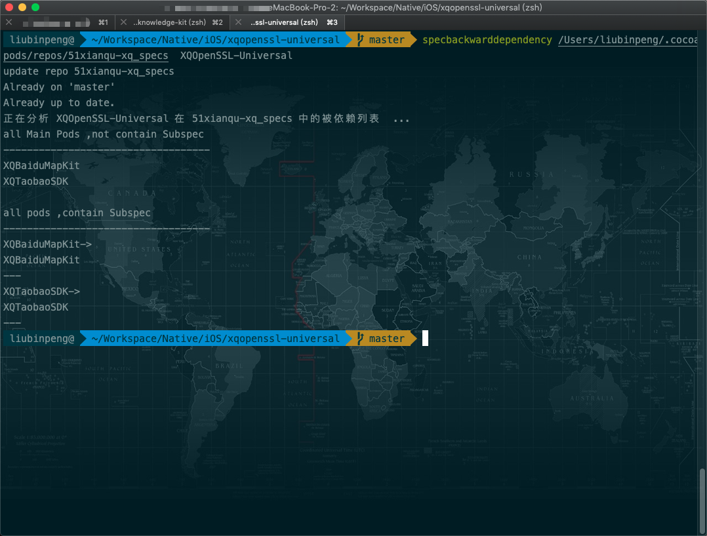

# Pod

## 1. 组件的地址

我们在做组件化的时候经常将一些业务模块封装打包，做成 pod 管理的形式，然后当在开发的时候需要修改一些模块化的代码。

当维护好组件的时候我们可能在一个新的工程设置好 podfile 引入组件，但是有可能需要继续修改组件的源代码，代码需要可编辑。所以我们可能需要将 Podfile 中的 pod 源修改为本地。
然后安装 pod install 后就可以看到在项目文件里面有可编辑的组件代码

```
pod 'GoodsCategoryModule', :path => '../GoodsCategoryModule'
#pod 'GoodsCategoryModule',:git => 'git@gitlab.xxx.com:forntend_ios/GoodsCategoryModule.git',:branch => 'release/Appstore'
```

注意点：
1. 我们本地的组件源代码需要和 pod 文件中的代码工程文件名称一致
2. 注释掉远端仓库的地址
path 后面是相对路径

## 2. 组件库使用 pch 头文件

```Objective-c
///一个区分开发和线上环境的Log。NSLog的本质是调用对象方法的 description 方法，所以线上代码使用NSLog会造成性能和安全问题
#ifdef DEBUG
    #define SafeLog(...) NSLog(__VA_ARGS__)
#else
    #define SafeLog(...)
#endif
```

所以我们需要对各个组件库里面的 **NSLog** 进行改造，变成 **SafeLog**。没做特殊处理，当你在 pod 库的 pch 文件写好代码，发现主工程执行 pod install 之后，看到之前写的 SafeLog 代码不见了。所以我们需要指定 pch 文件。
操作：
- 新建 **PrefixHeader.h** 头文件
- 在当前 pod 库的 ***.podspec 文件中写如下代码 
```Ruby
  s.prefix_header_contents = '#import "PrefixHeader.h"'
```
说明：该代码的作用相当于将 PrefixHeader.h 文件写入到当前 pod 库 XQTriggerKit-prefix.pch 文件的最后一行。相当于
```Objective-c
#ifdef __OBJC__
#import <UIKit/UIKit.h>
#else
#ifndef FOUNDATION_EXPORT
#if defined(__cplusplus)
#define FOUNDATION_EXPORT extern "C"
#else
#define FOUNDATION_EXPORT extern
#endif
#endif
#endif

#import "PrefixHeader.h"
```

缺点：项目存在多个 pod 组件库。主工程修改 pch 还好，但是每个 pod 库都去新建 PrefixHeader.h 文件和 podspec 文件添加一行代码。工作量非常大。

改进方案：对 NSLog 进行 Hook。

步骤：
- 引入 fishhook 库
- 新建 SafeLog.h 和 SafeLog.m 文件
- 在 SafeLog.m 文件的 load 方法中对 NSLog 进行 hook，判断是 Debug 环境就打印。代码如下

```Objective-c
#import "SafeLog.h"
#import "fishhook.h"

// orig_NSLog是原有方法被替换后 把原来的实现方法放到另一个地址中
// new_NSLog就是替换后的方法了
static void (*orig_NSLog)(NSString *format, ...);

@implementation SafeLog

void(new_NSLog)(NSString *format, ...)
{
    va_list args;
    if (format) {
        va_start(args, format);
        NSString *message = [[NSString alloc] initWithFormat:format arguments:args];
        #ifdef DEBUG
            orig_NSLog(@"%@", message);
        #endif
        va_end(args);
    }
}

+ (void)load
{
    rebind_symbols((struct rebinding[1]){{"NSLog", new_NSLog, (void *)&orig_NSLog}}, 1);
}

@end
```

## CocoPods 指定版本号带 ~> 与不带的区别

- 带 ~> 是指库版本号的一个范围。大于等于指定的版本号，小于高一位的版本号
- 不带 ~> 是指固定的版本号

```
pod 'aaa', '~> 0.1.2'  // 大于等于 0.1.2 且小于 0.2
pod 'bbb', '1.1' 版本号指定为 1.1

```

## 查看当前 Pod 库被何处引用

出于某种原因经常会需要查看当前 Pod 库被何处引用了（你需要修改组件库A，然后A修改完之后，可能需要在依赖组件库A的地方去修改版本号。这时候就需要查询了，例子可能不优雅，但是确实有需要查询引用的情况），有轮子

- 先下载所需要的库
```Shell
gem install reversepoddependency
```
- 利用脚本在我们的组件库 repo 中去查询
```
specbackwarddependency /Users/liubinpeng/.cocoapods/repos/51xianqu-xq_specs(本地CocoPod repo地址) xq_baaidumapkit(组件库名称)
```

鉴于这个命令比较长，且本人使用的是 iTerm2+Zsh，所以将命令写入到 .zshrc 文件中， source 编译链接过可以快速使用。例如 `repoanalysis xq_baaidumapkit`
```Shell
alias repoanalysis='specbackwarddependency /Users/liubinpeng/.cocoapods/repos/51xianqu-xq_specs' 
```



具体的操作步骤可以参考我的这个[文章](https://github.com/FantasticLBP/knowledge-kit/blob/master/第六部分%20开发杂谈/6.11.md)


